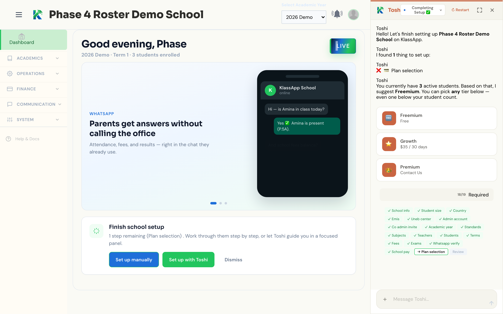

# KlassApp

**Educationists' tools connected by intelligence.**

[](LICENSE)
[](https://deepwiki.com/KlassApp-Foundation/KlassApp)

KlassApp is a multi-tenant school management platform, built first for the hardest real-world constraints — limited bandwidth, everyday phones — which is what makes it work anywhere schools need it. Schools run day-to-day operations in one place, while **Toshi** — KlassApp's AI agent — helps finish setup and keep work moving across the channels educationists already use. Parents get answers on **WhatsApp**. Admins and teachers work in the web dashboard. The product direction is an agentic protocol for education: role-aware actions, human-in-the-loop approvals, and connectors that grow with the school.

Live product: [https://klassapp.xyz](https://klassapp.xyz)



## Key Capabilities

- **WhatsApp-first parent operations** — Live Meta Cloud API messaging: attendance, fees, results, interactive menus, and delivery logging. Parents get answers without calling the office.
- **Toshi, the school AI agent** — In-product assistant for guided school setup and role-aware workflows in the dashboard (with WhatsApp-channel capability in the product). Auditable, gated, and designed for human confirmation on sensitive steps.
- **Connected tools schools already use** — The admin surface is built around WhatsApp, Google Drive, and Slack as first-class channels. WhatsApp messaging is the connector shipping in production today; Drive and Slack are part of the same product model as the protocol expands.
- **Real school operations** — Academics, attendance, exams and report cards, fees, staff and parent roles, notice board, and a full onboarding wizard — all scoped per school.
- **Multi-tenant by design** — Every query, job, cache key, and UI list is scoped by `school_id`. Cross-school data leaks are treated as bugs, not edge cases.
- **Hosted or self-run** — Production SaaS on Laravel Cloud (`klassapp.xyz`, EU-West-1). This repository is MIT-licensed so you can read the code and run your own copy.

## Quick Start

KlassApp is a Laravel 12 application. There is no one-line install script. Local setup looks like a normal Laravel + Vite project.

### Requirements

- PHP 8.4+, Composer 2, Node.js 20+ (or current LTS), npm
- MySQL 8 and Redis 7 — or Docker Compose from this repo
- Git

### 1. Clone and install

```bash
git clone https://github.com/KlassApp-Foundation/KlassApp.git
cd KlassApp
composer install
cp .env.example .env
php artisan key:generate
npm ci
```

If `npm ci` fails on peer deps, this repo ships `.npmrc` with `legacy-peer-deps=true` for known Vue 2-era peer declarations. Prefer that over deleting packages without an audit.

### 2. Configure `.env`

Minimum for a local boot:

```ini
APP_URL=http://localhost:8000
DB_CONNECTION=mysql
DB_HOST=127.0.0.1
DB_PORT=3306
DB_DATABASE=klassapp_local
DB_USERNAME=root
DB_PASSWORD=

CACHE_STORE=file
SESSION_DRIVER=file
QUEUE_CONNECTION=database

# Optional: Toshi LLM (leave off for a plain UI smoke test)
TOSHI_LLM_ENABLED=false
OPENAI_COMPATIBLE_URL=
OPENAI_COMPATIBLE_API_KEY=
OPENAI_COMPATIBLE_MODEL=

# Optional: WhatsApp Meta Cloud API (only if testing messaging locally)
WHATSAPP_BUSINESS_API_TOKEN=
WHATSAPP_BUSINESS_PHONE_NUMBER_ID=
WHATSAPP_BUSINESS_WABA_ID=
WHATSAPP_BUSINESS_VERIFY_TOKEN=
```

### 3. Database and services

**Option A — Docker Compose** (app + MySQL + Redis + nginx; typically port 8080):

```bash
docker compose up -d
```

Point `DB_HOST` / Redis at the compose services when PHP runs inside the app container, or keep `127.0.0.1` when using published ports from the host.

**Option B — Host MySQL/Redis** matching the `.env` values above.

Then:

```bash
php artisan migrate
php artisan storage:link
```

Prefer factories and feature tests over production-like school data. Never use real student or parent records for verification.

### 4. Run the app

```bash
# Terminal 1 — Vite (writes public/hot while running)
npm run dev

# Terminal 2 — Laravel
php artisan serve
```

Open [http://127.0.0.1:8000](http://127.0.0.1:8000). For a production-like asset build without HMR:

```bash
npm run build
php artisan serve
```

Do not leave `public/hot` behind when testing a production-style build; Laravel will try to load assets from a dead Vite server.

### 5. Tests

```bash
php artisan test --compact
# focused:
php artisan test --compact tests/Feature/ExampleTest.php
```

PHPUnit is the project standard. UI checks use Playwright scripts under `e2e/`.

### Try the hosted demo

Staging is a separate Laravel Cloud environment with demo/seed data (not a production dump). Public login credentials are **not** published here.

- Staging URL: [https://klassapp-staging-7mpoqg.laravel.cloud](https://klassapp-staging-7mpoqg.laravel.cloud)
- Request demo access: [community@klassapp.xyz](mailto:community@klassapp.xyz)

## Resources

- [Live product](https://klassapp.xyz)
- [Contributing guide](CONTRIBUTING.md)
- [Agent & maintainer rules](AGENTS.md)
- [Project provenance (GeGoK12 fork)](docs/project-provenance.md)
- [Code of Conduct](CODE_OF_CONDUCT.md)
- [Security policy](SECURITY.md)
- [DeepWiki overview](https://deepwiki.com/KlassApp-Foundation/KlassApp)
- Community: [community@klassapp.xyz](mailto:community@klassapp.xyz)

### Stack (short)

| Layer | Notes |
|---|---|
| PHP / Laravel | 8.4 / Laravel 12 |
| UI | Blade, Livewire 3, Vue 3.5 via `@vue/compat` (MODE 2), Vite 8 |
| CSS | Tailwind CSS 4 (CSS-first; no `tailwind.config.js`) |
| Data | MySQL 8, Redis 7 |
| Auth / API | Session web auth, Laravel Sanctum |
| AI | Laravel AI SDK + OpenAI-compatible LLM config for Toshi |
| Production | Laravel Cloud (`klassapp.xyz`, EU-West-1) |

Session history and verified ops notes live in [`knowledge.md`](knowledge.md) (maintainers).

## Contributing

1. Sync from latest `main` before starting (see [CONTRIBUTING.md](CONTRIBUTING.md)).
2. Prefer small, atomic PRs with real verification evidence.
3. Keep every feature multi-tenant (`school_id` end to end).
4. Do not commit secrets or real student/school data.

External contributor PRs get genuine human review before merge.

## License

KlassApp is released under the [MIT License](LICENSE).

You are free to use, copy, modify, merge, publish, distribute, sublicense, and/or sell copies of the Software, subject to the conditions in [`LICENSE`](LICENSE).
