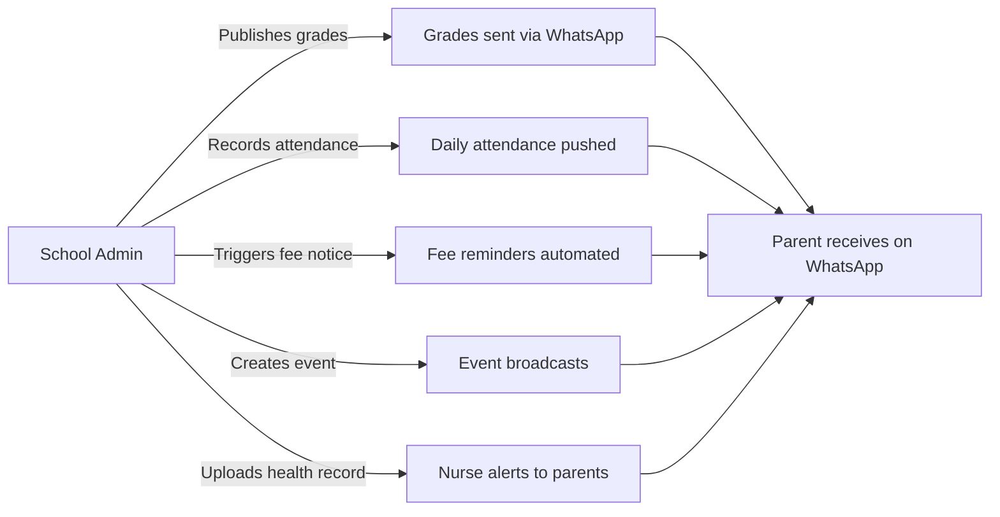
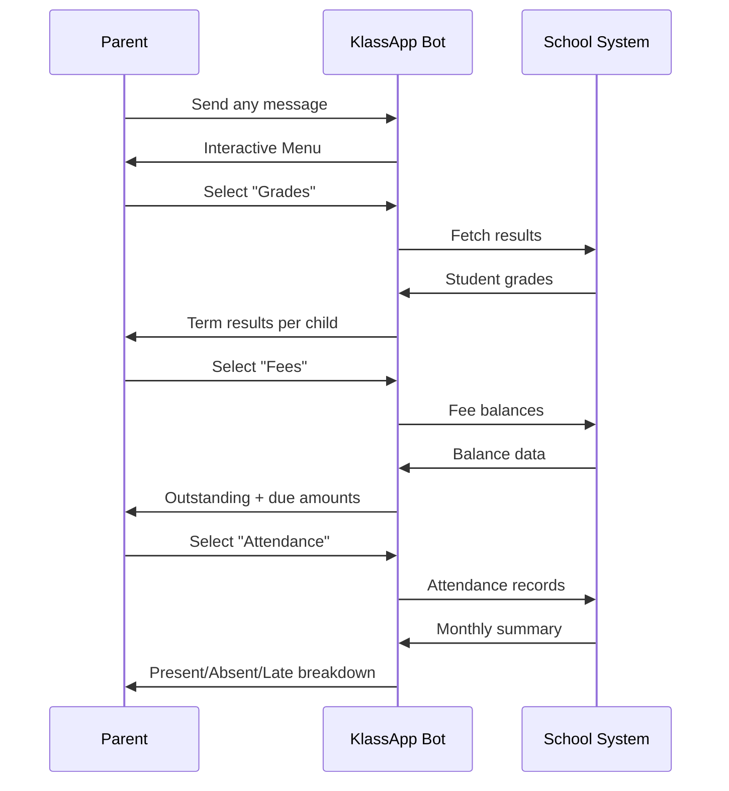

# KlassApp: WhatsApp for Schools

**Closing the communication gap between schools and families in Uganda.**

---

## The Problem

In Uganda, over **20 million students** attend school — yet the average parent has no real-time visibility into their child's education.

- **Grades** arrive on a report card — once a term, often weeks late
- **Fee balances** are a surprise at the school gate
- **Attendance status** is unknown until the child doesn't come home
- **School events** are communicated by handwritten note, if at all
- **Emergency closures** travel by word of mouth

Schools try to bridge this gap with SMS gateways, Facebook groups, and printed circulars — but these are fragmented, costly, and one-way. A school sending 500 SMS reminders at 30 UGX each spends 15,000 UGX per blast. Parents miss messages because they changed their SIM or the SMS landed in spam.

Meanwhile, **WhatsApp sits in every parent's pocket** — 98% of Ugandan smartphone users have it, with higher engagement than SMS, email, or any app.

---

## The Solution

KlassApp connects schools and parents through WhatsApp — the channel parents already use every day.

### For Schools (Admins + Staff)



- **Admin**: One-click grade publishing, fee reminder campaigns, school-wide broadcasts, delivery dashboard with real-time KPIs
- **Teacher**: Voice-mark attendance, push grade notifications, communicate class-specific updates
- **Bursar**: Automated fee reminders with balance breakdowns, payment confirmation receipts, overdue escalation
- **Librarian**: Overdue book alerts, new arrivals announcements, library closure notices
- **Nurse**: Health record updates, immunization reminders, sick-day notifications, medical emergency alerts
- **Secretary**: Exam schedule broadcasts, term calendar distribution, transport route changes

### For Parents



- **Grades received instantly** — not at end of term
- **Fee balances on demand** — no more surprises at the gate
- **Daily attendance** — know when your child misses class
- **Event calendar** — never miss a school meeting
- **No app to install** — works inside WhatsApp, zero data cost to learn
- **Self-registration** — link yourself to your child using their LIN (Learner Identification Number)

---

## Why It Works

```
┌─────────────────────────────────────────────────────────────┐
│                                                             │
│    WhatsApp in Uganda                                       │
│                                                             │
│    98% smartphone penetration                               │
│    No. 1 messaging app                                      │
│    Zero data cost (MTN/Airtel zero-rated)                   │
│    Parents already use it daily                             │
│                                                             │
└─────────────────────────────────────────────────────────────┘
                                │
                                ▼
┌─────────────────────────────────────────────────────────────┐
│                                                             │
│    KlassApp Bridge                                           │
│                                                             │
│    Two-way: schools push, parents pull                       │
│    Cost-effective: schools reach parents at a fraction       │
    │    of SMS costs                                          │
│    Interactive menus: no chatbots, just tap options          │
│    Multi-lingual: English + Luganda + Runyankore planned    │
│    Offline-friendly: messages queue and deliver on reconnect│
│                                                             │
└─────────────────────────────────────────────────────────────┘
                                │
                                ▼
┌─────────────────────────────────────────────────────────────┐
│                                                             │
│    Outcomes                                                 │
│                                                             │
│    Parents engaged, not just notified                       │
│    Fee collection improves (real-time balance visibility)   │
│    Attendance accountability (daily parent awareness)       │
│    Administrative burden drops (no more printing circulars) │
│    Every parent reached, regardless of SIM or device        │
│                                                             │
└─────────────────────────────────────────────────────────────┘
```

---

## The National Opportunity

Uganda has **74,000+ schools** — primary, secondary, and tertiary. Over **90% use WhatsApp informally** (class groups, parent-teacher chats) but none have a structured, integrated system.

The **EMIS / LIN** (Learner Identification Number) system, mandated by the Ministry of Education, gives every Ugandan student a unique 12-digit identifier. KlassApp uses this to solve the hardest problem in edtech: **connecting the right parent to the right student at national scale**.

- **Path 1 — CSV Import**: Schools upload their EMIS data. Parents are linked in bulk. Days to deploy.
- **Path 2 — Self-Registration**: Parents register themselves by sending their child's LIN via WhatsApp. No admin effort. National reach.
- **Path 3 — Ministry API**: Direct integration with the Ministry's EMIS database for real-time verification. (Long-term.)

This isn't a school management system. It's a **parent engagement network** — and every Ugandan student is a node waiting to be connected.

---

## What's in These Docs

| Doc | For |
|---|---|
| **[for-schools.md](for-schools.md)** | School admins and staff — how to deploy, configure roles, run notifications |
| **[for-parents.md](for-parents.md)** | Parents — how to link, use the menu, manage preferences |
| **[ecosystem.md](ecosystem.md)** | The bigger picture — market, competition, vision, roadmap |
| &nbsp;&nbsp;└ **[roadmap.md](roadmap.md)** | Detailed feature timeline and milestones |
| **[faq.md](faq.md)** | Common questions from schools and parents |

---

*KlassApp is built by GegoSoft Technologies. We believe that when parents are informed, students perform better.*
