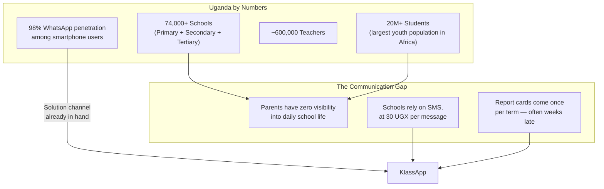
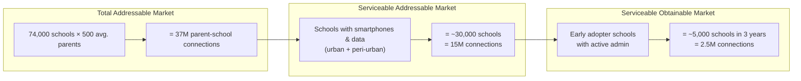
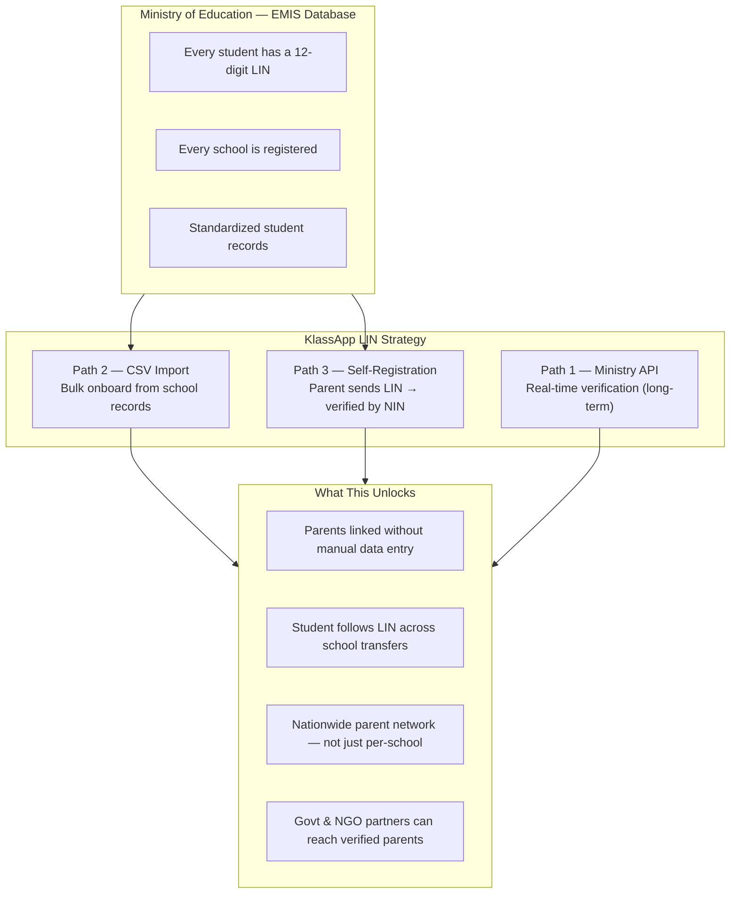
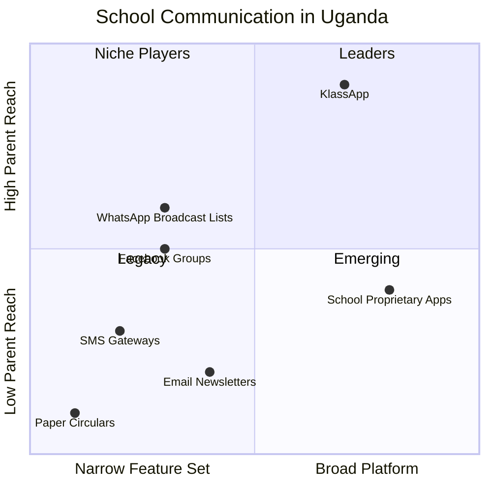
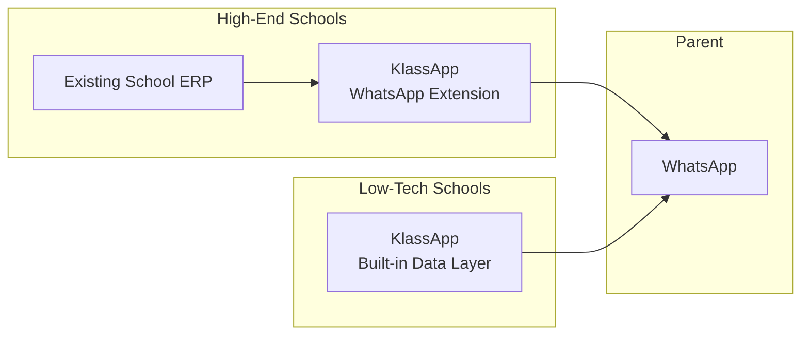
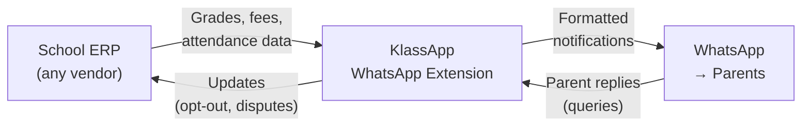

# Ecosystem

The bigger picture: market, vision, and why KlassApp's approach is different.

---

## The Market

Uganda's education system is massive, under-digitized, and ready for a parent-facing revolution.

### Why Now

| Factor | What Changed | Why It Matters |
|---|---|---|
| **WhatsApp reach** | Uganda has one of Africa's highest WhatsApp engagement rates; businesses can conversationally engage parents without per-message overhead | Every parent is already on WhatsApp — no app to install, no friction |
| **EMIS mandate** | Ministry of Education requires all students to have a LIN | Every student is already in a national database — we just connect the parent |
| **Smartphone adoption** | $40 smartphones now common; data costs at all-time low | WhatsApp is the de facto OS for most Ugandans |
| **Mobile money** | 70%+ of school fees paid via mobile money | Parents already transact on their phones — notifications drive action |

### Addressable Market

---

## The EMIS / LIN Advantage

Most edtech companies in Africa build features on top of school data. KlassApp built the **parent connection layer** — and the EMIS/LIN system is the key that unlocks it at national scale.

### Path 2: CSV Import (Now)

Schools upload their EMIS export. Parents are linked in bulk. No data entry. No manual matching.

### Path 3: Self-Registration (Next)

A parent texts their child's LIN to the bot. The bot asks for their NIN, verifies the hash against school records, and links them instantly. **Zero school admin effort.** The parent onboards themselves.

This is the moat: no other school communication tool in Uganda connects to the national LIN system. Every registered student is a potential connection.

---

## Competition

| Competitor Type | Approach | Weakness | KlassApp Advantage |
|---|---|---|---|
| **SMS gateways** | Bulk SMS to parent lists | Costly (30 UGX/msg), low engagement, one-way | WhatsApp is cheaper, two-way, higher open rates |
| **School Facebook groups** | Free, easy to set up | Algorithm hides posts, not private, chaotic | Private, structured, organized by student |
| **School apps** | Custom mobile app | Parents must download, update, remember password | Works inside WhatsApp — zero friction |
| **WhatsApp broadcast lists** | Manual, teacher-run | Unstructured, no automation, teacher burns out | Automated, scheduled, role-based |
| **Paper circulars** | Printed notes home | Lost, late, no read confirmation | Instant delivery with read receipts |

---

## Beyond School ERPs

Most school management systems in Uganda — whether digital or paper-based — are built for the school, not the parent. They track fees, grades, and attendance inside the admin office but have no way to push that information to families.

These systems fall into two camps:

| Type | Reach | Limitation |
|---|---|---|
| **High-end ERPs** (computer lab, dedicated IT staff) | Used by ~5% of schools | Built for admin, not parents. Parents get nothing. |
| **Paper-based / spreadsheets** (majority of schools) | No digital parent reach | Data exists but is inaccessible to parents. |

KlassApp sits at the **intersection of both**. It doesn't replace a school's existing system — it adds a parent-facing communication layer on top:

- For **high-end schools**: KlassApp integrates with their ERP via a custom WhatsApp extension and surfaces grades, fees, and attendance to parents automatically
- For **low-tech schools**: KlassApp's own lightweight data layer handles everything — no computer lab needed

Both types of school reach the same outcome: **parents informed via WhatsApp, with zero friction.**

This is the wedge: KlassApp works for the school with a $10,000 ERP and the school with a paper register. Both connect parents. Both pay the same. Neither has to change what works.

---

## The Vision

```mermaid
flowchart LR
    subgraph Phase1["Phase 1 — Connect"]
        F1["Grade notifications"]
        F2["Fee reminders"]
        F3["Attendance alerts"]
        F4["Interactive menu"]
    end

    subgraph Phase2["Phase 2 — Engage"]
        F5["Two-way conversation"]
        F6["Parent self-registration"]
        F7["Delivery dashboard"]
        F8["Cost optimization"]
    end

    subgraph Phase3["Phase 3 — Scale"]
        F9["LIN integration (Paths 2+3)"]
        F10["Multi-school admin"]
        F11["Nationwide parent network"]
        F12["Government data partnerships"]
    end

    Phase1 --> Phase2 --> Phase3
```

**Phase 1** (Complete): Grade publishing, fee reminders, attendance alerts, interactive bot menu.

**Phase 2** (Complete): Smart message delivery, notification queue, delivery dashboard, multi-child parent flow, delivery failure escalation.

**Phase 3** (In progress): EMIS/LIN integration — CSV bulk import (Path 2), parent self-registration (Path 3), nationwide parent network, potential government and NGO partnerships.

---

## Integrations

KlassApp is designed to fit into a school's existing tech stack, not replace it.

### School Pay

In-chat fee payment processing. When a parent checks their balance and sees fees due, they can pay directly within WhatsApp via mobile money. No portal login. No bank visit. The transaction updates the school's fee records in real time.

### Custom WhatsApp Extensions for School ERPs

Most Ugandan schools that have digitized use an ERP — but these systems are admin-facing only. KlassApp's custom extension layer bridges any ERP to WhatsApp:

The extension handles:
- Data mapping (ERP fields → WhatsApp message templates)
- Scheduled pushes (daily attendance, weekly fees, term grades)
- Inbound query routing (parent asks "fees" → extension fetches from ERP)
- Opt-out sync (parent opts out → ERP is updated)

This means KlassApp works with **any** school ERP — whether it's a local Ugandan developer's system, an international platform, or a custom-built solution.

### Google Workspace & Notion

| Integration | What It Unlocks |
|---|---|
| **Google Calendar** | School events sync automatically to parent WhatsApp |
| **Google Drive** | Report cards and circulars attached as documents in chat |
| **Notion** | School policies, term schedules, and staff wikis accessible from the bot |

---

## Metrics That Matter

| Metric | Current (Pilot) | Target (Year 1) | Target (Year 3) |
|---|---|---|---|
| Schools active | 5 | 100 | 5,000 |
| Parents linked | ~500 | 50,000 | 2.5M |
| Messages/month | 10,000 | 2M | 100M |
| Delivery rate | 94% | 95%+ | 97%+ |
| Parent opt-in rate | TBD | 70%+ | 85%+ |
| Self-registration (% of new links) | 0% | 20% | 60% |

---

*See the [roadmap](roadmap.md) for what's coming next.*
