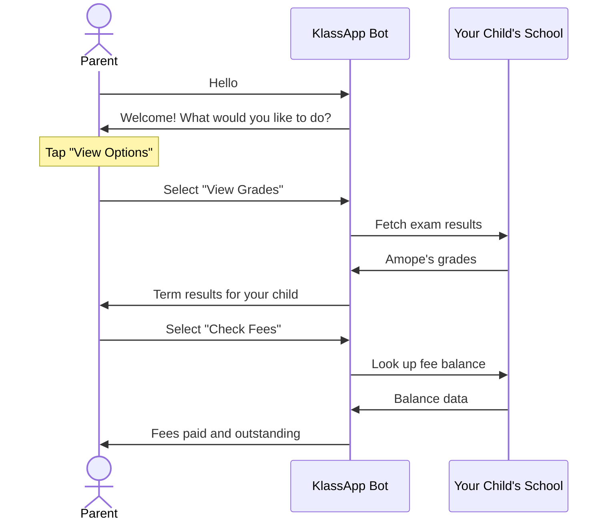
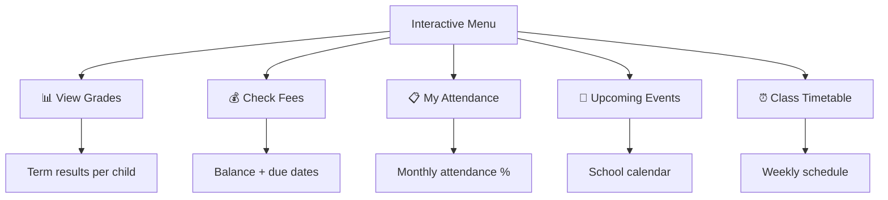
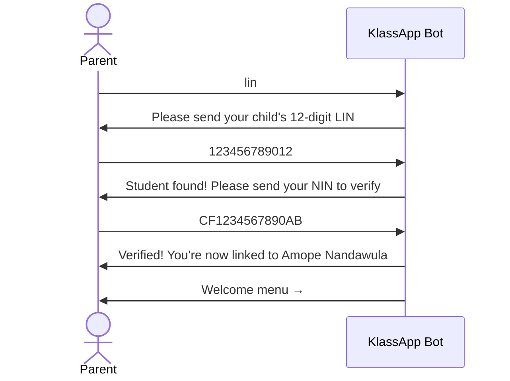

# For Parents

You care deeply about your child's education. KlassApp makes sure you're never left wondering.

When exams are marked, you know. When your child is absent, you know. When fees are due, you know before you arrive at the school gate and find out the hard way.

All of this reaches you through WhatsApp, the app already on your phone. No new app to download. No account to create. No password to remember. Just a message.

**It's free to receive messages.** WhatsApp is zero-rated on MTN and Airtel in Uganda, meaning you don't use your data bundle to receive KlassApp notifications.

---

## How It Works

KlassApp turns your child's school into a WhatsApp contact. You talk to it the same way you talk to any other contact. Send a message, get a reply. No app to download, no account to create, no password to remember.



---

## What You Can Do

### Check Grades

```
*Grade Report — Term 1 2026*
_Amope Nandawula — Primary 5A_

Mathematics:  85%  (A)
English:      72%  (B+)
Science:      80%  (A-)
Social Studies: 68%  (B)

Total:   305/400 — 76.25% (B+)

Reply GRADES for other children.
```

No more waiting for report card day. See results the moment the school publishes them.

### Check Fee Balance

```
Amope Nandawula — Primary 5A
Tuition:     500,000/500,000  ✓ Paid
Transport:   120,000/120,000  ✓ Paid
Lunch:        80,000/150,000  ✗ Outstanding

Total Paid:   700,000
Balance:      70,000
Due Date:     15 June 2026
```

Know exactly what you owe and when it's due. No more surprises at the school gate.

### View Attendance

```
*Attendance — Month of May 2026*
_Amope Nandawula_

School days:   22
Present:       20
Absent:        1
Late:          1

Attendance:    91%

Reply ATTENDANCE for daily breakdown.
```

Some schools also send same-day alerts if your child is marked absent.

### Receive Fee Reminders

```
*Friendly Reminder*
Dear Mr. Mukasa,

Fee payment of 70,000 UGX for Amope
is due on 15 June 2026.

Pay via school portal or bank.

Reply FEES to see full breakdown.
```

Payment reminders come weekly. If fees become overdue, you'll receive escalation notices so nothing slips through.

### Get Event Notifications

```
*Upcoming Events — St. Mary's School*

📅 Sports Day: 22 March
📅 Parents Meeting: 5 April
📅 Exams: 21-28 April
📅 Closing: 30 April

Reply EVENTS for details.
```

School term calendars, exam schedules, and event updates are sent automatically.

### Health & Emergency Alerts

```
*Health Notice*
Amope Nandawula — Primary 5A

Immunization: Polio booster administered

Reply HEALTH for full record.
```

Some schools also send sick-day alerts when your child is sent home.

---

## The Menu

Send any message to the KlassApp bot and you'll receive an interactive menu. Tap the button to see your options:

| Option | What You Get |
|---|---|
| **View Grades** | Latest results for all your children |
| **Check Fees** | Fee balances, payments, and due dates |
| **My Attendance** | Monthly attendance summary |
| **Upcoming Events** | School calendar and event details |
| **Class Timetable** | Your child's weekly schedule |
| **Settings** | Manage your preferences |



---

## Linking to Your Child

### Method 1: School Links You

The school imports your phone number from their records. You'll receive a welcome message automatically. This is the most common method.

### Method 2: Self-Registration (Using LIN)

> **What is a LIN?** Your child's Learner Identification Number (LIN) is a 12-digit code assigned to them by the Ministry of Education. It appears on their school admission letter, their UNEB registration slip, or you can ask for it at the school office.

If your school supports self-registration, you can link yourself:

1. Send **"lin"** to the KlassApp bot
2. Send your child's **12-digit LIN (Learner Identification Number)**
3. Send your **NIN (National ID Number)** when asked



> Your NIN is never stored in plaintext. It's hashed immediately and discarded. Only the school can verify you, not KlassApp.

---

## Managing Your Experience

### Opt Out Anytime

Reply **OPTOUT** to stop receiving messages. Your phone stays linked but no notifications are sent.

### Opt Back In

Reply **OPTIN** to re-enable notifications.

### Multiple Children

If you have more than one child at the school (or at different schools using KlassApp), all their information comes through one number. Menus and queries automatically consider all your linked children.

### Multiple Schools

If your children attend different schools that both use KlassApp, everything comes through your one WhatsApp number. Each school's data is kept separate. Switching between them is as simple as the menu.

---

## Important to Know

## Still Have Questions?

See the [FAQ](faq.md) for common questions, or contact your school directly.

---

## Important to Know

| Topic | Detail |
|---|---|
| **Cost** | Receiving messages is free. Sending messages uses your standard WhatsApp data (often zero-rated by MTN/Airtel) |
| **Data** | Only your phone number and linked children are stored. Your NIN is hashed and never stored as plaintext |
| **Your NIN** | Your National ID number is never stored. It is hashed (converted to a code) the moment you send it, and the original is immediately discarded. Not even KlassApp staff can see it. |
| **Control** | You can opt out at any time. The school controls what messages are sent |
| **School independence** | Each school manages their own data. Moving schools? Your previous school's data stays with them |
| **Group chats** | You are messaged individually, not added to any broadcast groups |
