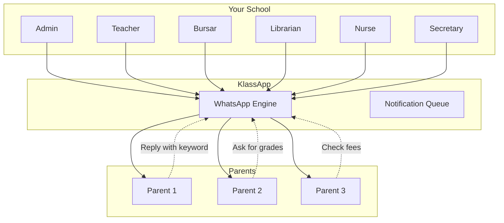
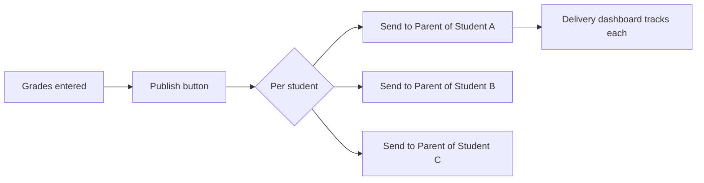
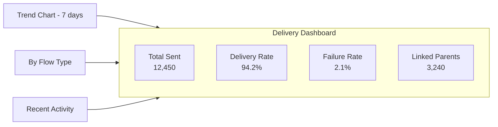
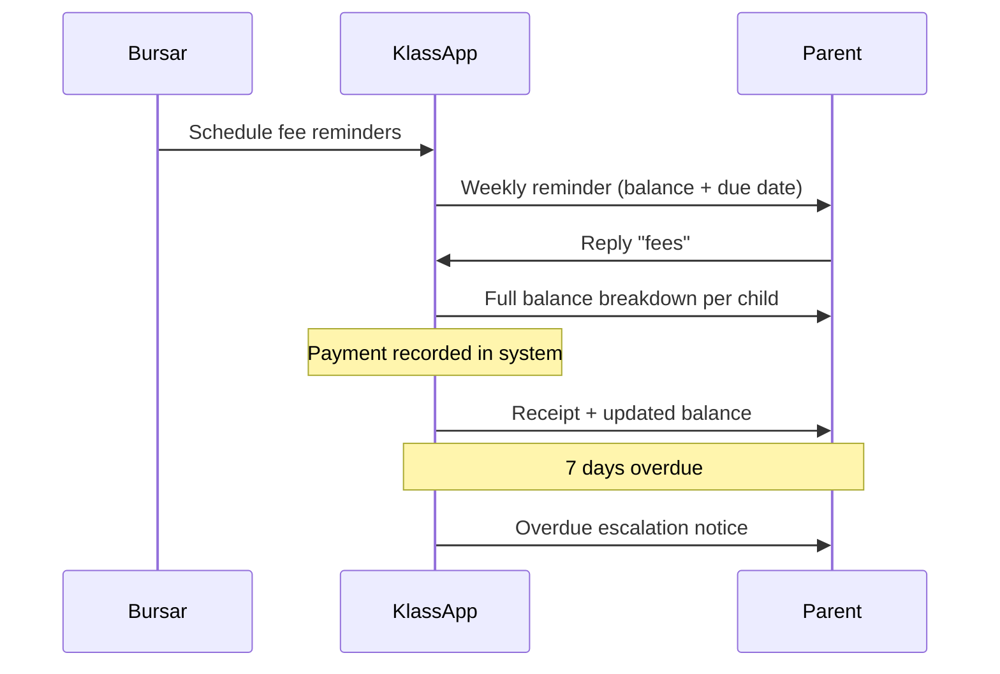
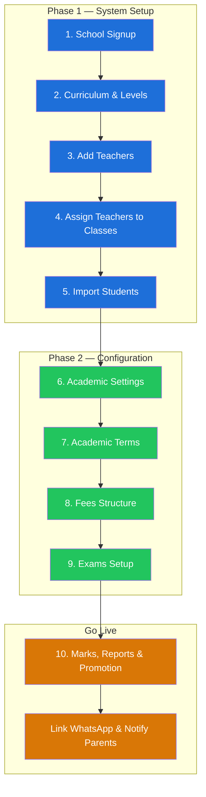
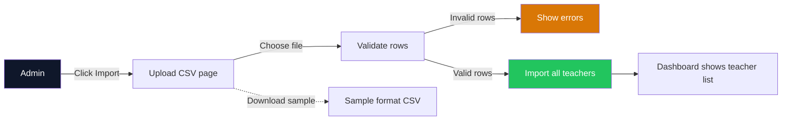
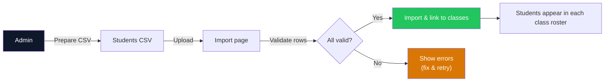

# For Schools

How KlassApp WhatsApp transforms communication across every role in your school.

---

## Overview

KlassApp doesn't replace a school's existing system. It adds a parent-facing communication layer on top. KlassApp plugs into your existing school management system (or works alongside it) and adds a WhatsApp layer that reaches every parent. No new app for parents to install. No training. Just a bot they already know how to use.



---

## For School Admins

### One-Click Grade Publishing

When exam results are finalized, publishing to parents is a single action:

1. Enter marks as usual in your existing gradebook
2. Click **Notify Parents via WhatsApp**
3. Every parent with a linked number receives their child's results instantly



Each message is personalized per child: name, subject scores, grade, and teacher comments. Parents of multiple children receive separate messages for each.

### Fee Reminder Campaigns

Replace expensive SMS blasts with WhatsApp reminders that cost a fraction:

| Feature | SMS | KlassApp WhatsApp |
|---|---|---|
| Cost per message | 30 UGX | 0-15 UGX |
| Delivery rate | ~70% | 95%+ |
| Rich formatting | Plain text | Bold, tables, clickable |
| Parent reply | No | Yes (check balance, dispute) |
| Read receipts | No | Yes (delivered/read tracking) |

**Campaign Types:**

| Type | Frequency | Audience | Content |
|---|---|---|---|
| **Reminder** | Weekly (Mondays) | Parents with outstanding balance | Amount due, deadline, payment methods |
| **Overdue** | Daily | Parents past due date | Escalation notice, late fee warning |
| **Receipt** | On payment | The paying parent | Confirmation, updated balance |

All campaigns work in **dry-run mode** first. You preview exactly who will be contacted and what the message will look like before sending live.

### Delivery Dashboard

A real-time dashboard shows you:



- **Total messages sent** this week / month / quarter
- **Delivery rate**: percentage that reached parents
- **Failure rate**: messages that bounced (with reasons)
- **Linked parents**: how many have active WhatsApp connections
- **Trend chart**: daily volume over 7/30/90 days
- **Flow breakdown**: grades vs fees vs attendance vs events
- **Recent activity**: last 50 messages with status

### Batch Student Import

Onboard your entire school at once. Export your student records from LIN and upload as a CSV:

```csv
student_lin,parent_phone,parent_nin
123456789012,+256701234567,CF1234567890AB
123456789013,+256712345678,CF9876543210BA
```

The system validates every row, links each student to their parent's WhatsApp, and sends a welcome message. A summary report shows successes, failures, and reasons.

---

## For Teachers

### Attendance Alerts

Mark attendance in your existing register and parents receive a daily summary:

```
Good evening, Mrs. Nakato.

Amope's attendance today (Monday, 2 June):
✓ Present: Morning session
✓ Present: Afternoon session

Reply ATTENDANCE for monthly summary.
```

Absentee notifications can be sent immediately (not end-of-day) if the school wants real-time alerts.

### Grade Publishing

When you finalize marks, parents see:

```
*Grade Report — Term 1 2026*
_Amope Nandawula — Primary 5A_

Mathematics:  85%  (A)
English:      72%  (B+)
Science:      80%  (A-)
Social Studies: 68%  (B)

Total:   305/400
Average: 76.25%  (B+)

Reply GRADES for other children.
```

### Class Announcements

Need to inform parents about a schedule change, homework deadline, or class trip? Send a targeted broadcast to your class's parents.

---

## For Bursars / Accountants

### Automated Fee Workflow

The result: parents pay on time because they always know what they owe. Schools that switch to WhatsApp reminders report fee collection improving within the first term.



### Fee Balance on Demand

Parents can check their balance anytime by sending "fees":

```
Amope Nandawula — Primary 5A
Tuition:     500,000/500,000  ✓ Paid
Transport:   120,000/120,000  ✓ Paid
Lunch:        80,000/150,000  ✗ Outstanding

Total Paid:   700,000
Balance:      70,000
Due Date:     15 June 2026
```

### Payment Confirmation

When a payment is recorded, the parent automatically receives a receipt via WhatsApp. No printing, no lost slips.

---

## For Librarians

### Overdue Book Alerts

Automated reminders for borrowed books:

```
*Library Notice*
Dear Mr. Mukasa,

The following books are overdue:
1. "Primary Science" — due 20 May (14 days overdue)
2. "English Grammar" — due 25 May (9 days overdue)

Late fee: 5,000 UGX
Please return to the library.
```

### New Arrivals

Broadcast new books, reading programs, and library closure notices to all parents.

---

## For Nurses

### Health Record Updates

When a student's health record is updated (immunization, checkup, incident), the parent is notified:

```
*Health Notice*
Amope Nandawula — Primary 5A

Immunization: Polio booster administered today
Next dose: December 2026

Reply HEALTH for full record.
```

### Sick-Day / Emergency Alerts

If a child is sent home sick or there's a medical incident, the parent is alerted in real time.

---

## For Secretaries

### Term Calendar Distribution

At the start of term, parents receive the full calendar:

```
*St. Mary's School — Term 1 2026 Calendar*

📅 Opening: 3 February
📅 Closing: 30 April
📅 Mid-term: 10-14 March
📅 Sports Day: 22 March
📅 Parents Meeting: 5 April
📅 Exams: 21-28 April

Reply EVENTS for updates.
```

### Exam Schedule

Before exams, parents receive the timetable automatically.

### Transport & Closure Updates

Route changes, early closings, and emergency closures reach every parent immediately. No phone trees, no SMS credits.

---

## School Setup Guide — Onboarding a New School

Onboarding a new school follows two phases. **Phase 1** covers the system setup: school registration, curriculum, staff, students, and class assignments. **Phase 2** covers configuration: academic terms, fee structures, grading, and exams. Once both phases are complete, the school is ready to start running and sending communications.



---

### Phase 1 — System Setup

#### 1. School Signup

The school admin creates the account by providing:

- School name
- Admin name (Head Teacher, Secretary, or assigned person)
- Country
- Mobile number
- Approximate number of students
- Email address
- Password

Once submitted, the system creates the school profile and redirects to the setup wizard.

#### 2. Curriculum & Levels

After signup, the admin selects the school's education structure:

- **Board of Education** — typically UNEB
- **Highest level offered** — nursery, primary, O-level, A-level, or a combination

When you select a level, the system automatically creates:
- **Default subjects** for each class under that level
- **A default grading system** with standard grade boundaries

> Selecting **Primary** automatically creates the nursery section alongside it — primary schools do not need to set up nursery separately.

#### 3. Add Teachers

Navigate to **Users > Staff > Teachers**. The page shows all existing teachers. In the top-right corner, three options are available: **Add**, **Export**, and **Import**.

**Add (single teacher)** — best when onboarding a few teachers (1-2). Fill in their details manually.

**Import (bulk CSV)** — the recommended approach for first-time school setup. Prepare a CSV or Excel file with these columns:

```csv
firstname,lastname,mobile_no,email,gender,date_of_birth,address,district,region,country,joining_date,employee_id,specialization,designation,notes
```



Click **Download Sample Format** to get a template with the correct columns. After uploading, the system processes the file and adds all teachers in one go.

#### 4. Assign Teachers to Classes & Subjects

Go to **Classes**. If no classes are set up yet, the page will be empty. In the top-right corner, use the **Setup A Class** button.

For each class, select:

- **Level** (e.g. Primary)
- **Class** (e.g. P.6)
- **Class Teacher**

After selecting these, a form appears linking subjects to teachers. The subjects are auto-populated from the level setup. For each subject, pick the teacher from a dropdown. Click **Save Class Details** to finish.

Repeat for every class in the school.

#### 5. Import Students

The process is similar to adding teachers. Navigate to the student section and use **Import** to upload a CSV with the following columns:

```csv
firstname,lastname,gender,date_of_birth,class,address,region,district,country,mother_tongue,joining_date
```



The system matches the **class** column to the classes already set up in Phase 1 Step 4. Each student is enrolled in the correct class automatically. Parents can be linked later via CSV upload (see WhatsApp activation below).

---

### Phase 2 — Configuration

#### 6. Academic Settings

**Academic Years**
The system shows two years: the current year and the next year. Verify that the correct year is marked as **Current Academic Year** in the Type column. If not, click **Change Current Academic Year** in the top-right corner.

To edit a year, click the pen icon under Actions. The Type options are:
- **New Academic Year** — next year
- **Current Academic Year** — today's year
- **Old Year** — previous year

**School Details**
Edit the school profile — address, motto, contact info — before proceeding. This information appears on student report cards and official communications.

**Grading System**
A default grading system is created during Phase 1 Step 2. Modify ranges as needed, or add a new range by clicking **Add Grading Rule**.

**Promotion Rules**
Define how students are promoted at year-end. Click **+ Add Promotion Rule** and configure:

- **Class** — target class
- **Rule Type** — Points, Aggregates, or Average
  - If **Average**: set a minimum average score
  - If **Points**: set a minimum points threshold
  - If **Aggregates**: set a maximum aggregate (e.g. 20 or below passes)

Students who meet the rule are automatically promoted at term-end.

#### 7. Academic Terms

Add the school's academic terms for the current year. Click **Add Term** in the top-right corner and provide:

- **Name** — e.g. Term 1, Term 2, Term 3
- **Starts on** — the date the term begins
- **Ends on** — the date the term ends

After saving one term, repeat for the remaining terms. At the end of the academic year, update the term dates by clicking the edit button under Actions — you do not need to delete and recreate them.

#### 8. Fees Structure

Navigate to the Fees page. If no structure exists, click **+ Add Category**. Fill in:

- **Level** — e.g. Primary
- **Class** — select a specific class, or **Select All** if the fee is uniform
- **Academic Term** — select a specific term, or **Select All** if the fee applies every term
- **Fee Name** — e.g. Academics, School System, Food, Security, Transport
- **Amount** — the fee amount for that line item (not the total school fees)

Add each fee category separately. The system sums them automatically per student.

#### 9. Exams Setup

Navigate to Exams. Click **Add Exam** to create a new exam. Select the class first, then fill in the exam details. Each exam can be assigned to specific teachers. You can add multiple exams per term (e.g. Mid-Term, End-of-Term, End-of-Year).

---

### Phase 3 — Go Live

#### 10. Marks, Report Cards & Promotion

Once exams are set up and marks are entered:

1. **Filter** by Term, Class, and Exam Type to view marks
2. **Download marks sheet** — click **Download Marks Sheet** in the top-right corner
3. **View reports** — each student's marks are available in a printable report format (PDF)
4. **Promote students** — at the end of the academic year, finalize promotion using the promotion rules configured in Phase 2 Step 6

> If it is the end-of-year exam, download marks sheets and reports **before** promoting students. Once promoted, the previous year's class data is archived.

#### 11. Link WhatsApp & Activate

Once the system is fully configured:

1. **Link your WhatsApp number** — the school admin connects their WhatsApp number through the admin panel. This is the number parents will receive messages from.
2. **Import parents** — upload a CSV roster linking each student to a parent's phone number
3. **Configure roles** — assign which staff members can trigger which notifications (admins control everything, teachers only their classes, bursars only fees)
4. **Run a dry test** — send a test fee reminder to preview messages and verify delivery
5. **Go live** — the first real notification goes out. Parents who are not yet linked receive an invitation to register.

---

## Pricing

KlassApp offers three tiers based on school size. All tiers include the full WhatsApp parent layer.

| Tier | Students | Pricing |
|---|---|---|
| **Starter** | Up to 200 | Free |
| **Growth** | Up to 1,000 | Contact us |
| **Premium** | Unlimited | Contact us |

Premium schools also receive a custom branded school page on klassapp.com, a professional digital presence that parents can find and share.

[Request pricing →](mailto:info@klassapp.com)

---

## Privacy & Opt-Out

- Parents can opt out at any time by replying "OPTOUT"
- No parent phone numbers are visible to other parents
- Messages are sent individually (not broadcast groups)
- The school controls exactly what is sent and when
- Data is stored in Uganda (with your school's database)
