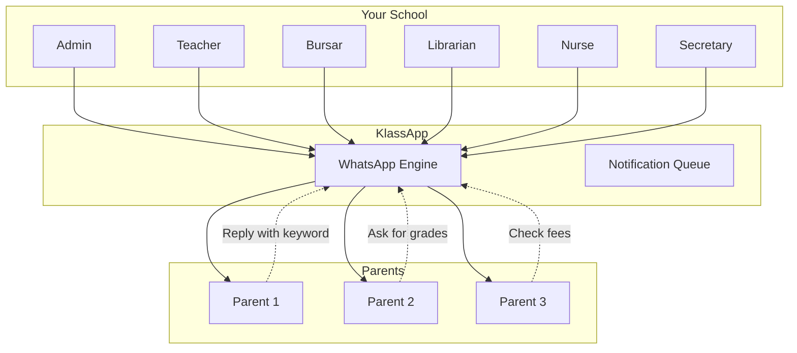
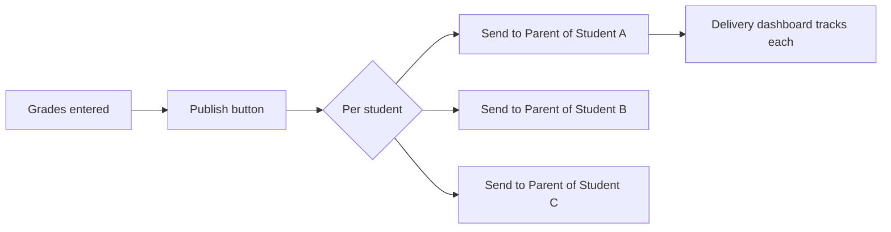
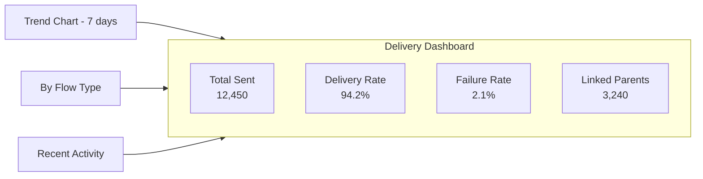
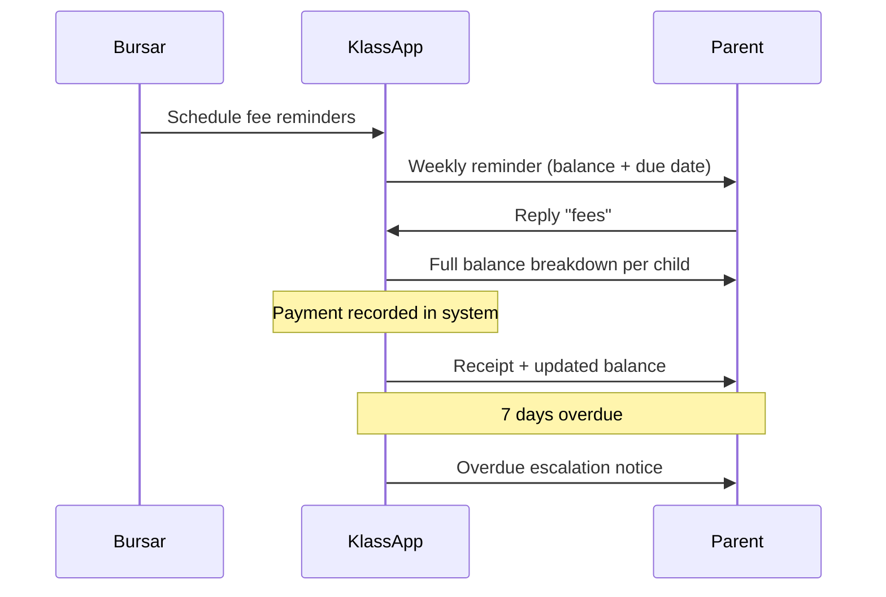

# For Schools

How KlassApp WhatsApp transforms communication across every role in your school.

---

## Overview

KlassApp plugs into your existing school management system (or works alongside it) and adds a WhatsApp layer that reaches every parent. No new app for parents to install. No training. Just a bot they already know how to use.



---

## For School Admins

### One-Click Grade Publishing

When exam results are finalized, publishing to parents is a single action:

1. Enter marks as usual in your existing gradebook
2. Click **Notify Parents via WhatsApp**
3. Every parent with a linked number receives their child's results instantly



Each message is personalized per child — name, subject scores, grade, and teacher comments. Parents of multiple children receive separate messages for each.

### Fee Reminder Campaigns

Replace expensive SMS blasts with WhatsApp reminders that cost a fraction:

| Feature | SMS | KlassApp WhatsApp |
|---|---|---|
| Cost per message | 30 UGX | 0-15 UGX |
| Delivery rate | ~70% | 95%+ |
| Rich formatting | Plain text | Bold, tables, clickable |
| Parent reply | No | Yes — check balance, dispute |
| Read receipts | No | Yes (delivered/read tracking) |

**Campaign Types:**

| Type | Frequency | Audience | Content |
|---|---|---|---|
| **Reminder** | Weekly (Mondays) | Parents with outstanding balance | Amount due, deadline, payment methods |
| **Overdue** | Daily | Parents past due date | Escalation notice, late fee warning |
| **Receipt** | On payment | The paying parent | Confirmation, updated balance |

All campaigns work in **dry-run mode** first — preview exactly who will be contacted and what the message will look like before sending live.

### Delivery Dashboard

A real-time dashboard shows you:



- **Total messages sent** this week / month / quarter
- **Delivery rate** — percentage that reached parents
- **Failure rate** — messages that bounced (with reasons)
- **Linked parents** — how many have active WhatsApp connections
- **Trend chart** — daily volume over 7/30/90 days
- **Flow breakdown** — grades vs fees vs attendance vs events
- **Recent activity** — last 50 messages with status

### Batch Student Import

Onboard your entire school at once. Export your student records from EMIS and upload as a CSV:

```csv
student_lin,parent_phone,parent_nin
123456789012,+256701234567,CF1234567890AB
123456789013,+256712345678,CF9876543210BA
```

The system validates every row, links each student to their parent's WhatsApp, and sends a welcome message. A summary report shows successes, failures, and reasons.

---

## For Teachers

### Attendance Alerts

Mark attendance in your existing register — parents receive a daily summary:

```
Good evening, Mrs. Nakato.

Amope's attendance today (Monday, 2 June):
✓ Present: Morning session
✓ Present: Afternoon session

Reply ATTENDANCE for monthly summary.
```

Absentee notifications can be sent immediately (not end-of-day) if the school wants real-time alerts.

### Grade Publishing

When you finalize marks, parents see:

```
*Grade Report — Term 1 2026*
_Amope Nandawula — Primary 5A_

Mathematics:  85%  (A)
English:      72%  (B+)
Science:      80%  (A-)
Social Studies: 68%  (B)

Total:   305/400
Average: 76.25%  (B+)

Reply GRADES for other children.
```

### Class Announcements

Need to inform parents about a schedule change, homework deadline, or class trip? Send a targeted broadcast to your class's parents.

---

## For Bursars / Accountants

### Automated Fee Workflow



### Fee Balance on Demand

Parents can check their balance anytime by sending "fees":

```
Amope Nandawula — Primary 5A
Tuition:     500,000/500,000  ✓ Paid
Transport:   120,000/120,000  ✓ Paid
Lunch:        80,000/150,000  ✗ Outstanding

Total Paid:   700,000
Balance:      70,000
Due Date:     15 June 2026
```

### Payment Confirmation

When a payment is recorded, the parent automatically receives a receipt via WhatsApp — no printing, no lost slips.

---

## For Librarians

### Overdue Book Alerts

Automated reminders for borrowed books:

```
*Library Notice*
Dear Mr. Mukasa,

The following books are overdue:
1. "Primary Science" — due 20 May (14 days overdue)
2. "English Grammar" — due 25 May (9 days overdue)

Late fee: 5,000 UGX
Please return to the library.
```

### New Arrivals

Broadcast new books, reading programs, and library closure notices to all parents.

---

## For Nurses

### Health Record Updates

When a student's health record is updated (immunization, checkup, incident), the parent is notified:

```
*Health Notice*
Amope Nandawula — Primary 5A

Immunization: Polio booster administered today
Next dose: December 2026

Reply HEALTH for full record.
```

### Sick-Day / Emergency Alerts

If a child is sent home sick or there's a medical incident, the parent is alerted in real time.

---

## For Secretaries

### Term Calendar Distribution

At the start of term, parents receive the full calendar:

```
*St. Mary's School — Term 1 2026 Calendar*

📅 Opening: 3 February
📅 Closing: 30 April
📅 Mid-term: 10-14 March
📅 Sports Day: 22 March
📅 Parents Meeting: 5 April
📅 Exams: 21-28 April

Reply EVENTS for updates.
```

### Exam Schedule

Before exams, parents receive the timetable automatically.

### Transport & Closure Updates

Route changes, early closings, and emergency closures reach every parent immediately — no phone trees, no SMS credits.

---

## Getting Started

### Step 1: Link Your WhatsApp Number

The school admin links their own WhatsApp number through the admin panel. This is used to send notifications.

### Step 2: Import Parents

Upload your student roster (CSV from EMIS or school system) to link parents to their children.

### Step 3: Configure Roles

Assign which staff members can trigger which notifications — admins control everything, teachers only their classes, bursars only fees.

### Step 4: Run a Test

Send a dry-run fee reminder to preview messages and verify delivery.

### Step 5: Go Live

The first real notification goes out. Parents who aren't yet linked receive an invitation to register.

---

## Privacy & Opt-Out

- Parents can opt out at any time by replying "OPTOUT"
- No parent phone numbers are visible to other parents
- Messages are sent individually (not broadcast groups)
- The school controls exactly what is sent and when
- Data is stored in Uganda (with your school's database)
