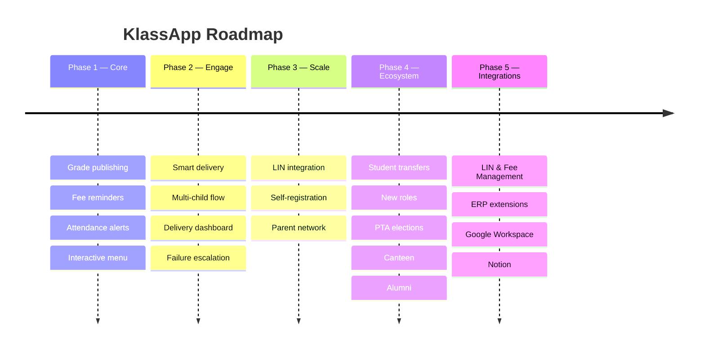

# Roadmap

---

## Student Transfers Between Schools

A parent should be able to transfer their child from one school to another at their discretion within the KlassApp ecosystem. When a child moves:

- The parent initiates the transfer from the WhatsApp menu
- The new school receives a verification request
- Upon approval, the child's parent link, grade history, and attendance records are shared with the new school
- The former school retains a copy, preserving their data independence

This makes KlassApp sticky across a student's entire academic journey, not just per-school.

**Future vision**: Student academic data lives on blockchain, owned by the parent and student, not by any single school. A transfer becomes a permission grant: the parent authorizes the new school to view the student's on-chain record. No school owns the data; the student carries it.

---

## More Roles

The current role set (admin, teacher, bursar, librarian, nurse, secretary) will expand to cover the full school ecosystem:

| Role | Planned Features |
|---|---|
| **Guidance & Counsellor** | Referral notices, session reminders, wellness check-ins |
| **Sports Master** | Fixture broadcasts, trial invitations, match results |
| **Transport Manager** | Route updates, ETA notifications, delay alerts |
| **Boarding Master** | Weekend sign-out/sign-in, dormitory notices, visiting day info |
| **PTA Representative** | Meeting broadcasts, parent feedback collection |
| **Class Prefect / Head Boy/Girl** | Announcement relays, event coordination (student-facing) |

---

## Pricing Tiers

| Tier | Students | Pricing | Key Features |
|---|---|---|---|
| **Starter** | Up to 200 | Free | Full WhatsApp parent layer, fee reminders, grade publishing, attendance alerts |
| **Growth** | Up to 1,000 | Contact us | All Starter features + delivery dashboard, multi-child, priority support |
| **Premium** | Unlimited | Contact us | All Growth features + custom branded school page, dedicated onboarding, ERP integration

---

## Feature Modules

### Transparent PTA Elections

Fair, verifiable elections for:
- Parent-Teacher Association (PTA) elections
- School board decisions
- Student council elections
- Policy ratification (uniform changes, fee adjustments)

Every vote is recorded immutably. Any stakeholder can verify the tally without trusting a central authority.

### Permanent Digital Records

Important student documents that never get lost:
- Report cards and transcripts (parent can request a verifiable copy)
- Circulars and policy documents
- Student portfolio artifacts
- Sports and event photos (with parent consent)
- Medical records and immunization certificates

Documents are stored permanently and tamper-proof, accessible anytime from WhatsApp.

### Canteen Module

- Daily menu broadcast to parents
- Pre-order and prepayment for meals
- Dietary restriction alerts
- Balance top-up reminders
- Meal history per student

### Alumni Module

- Graduating student auto-enrollment into alumni network
- Alumni event invitations via WhatsApp
- Fundraising and donation drives
- Mentorship matching (alumni → current students)
- Career opportunity broadcasts
- Reunion coordination

---

## Integrations

| Integration | Purpose |
|---|---|
| **Google Workspace** | Sync classroom calendars, Drive documents for report attachments |
| **Notion** | School wiki, policy docs, staff knowledge base sync |
| **LIN & Fee Management** | Fee balance notifications and reminders tied to each student's LIN |
| **Custom WhatsApp Extensions** | Sits on top of any school ERP and surfaces relevant data to parents, without replacing the school's existing system |
| **Calendar (Google / Outlook)** | Two-way sync of school events and parent calendar |

This is KlassApp's core differentiator. Most schools in the region already run some form of digital record system, but these are built for the admin office. The parent is left out entirely. KlassApp's custom WhatsApp extension layer sits on top of any ERP, from a $50 spreadsheet setup to a $10,000 integrated platform, and surfaces grades, fees, attendance, and events directly to parents via WhatsApp. The school keeps what works. KlassApp adds the parent connection.

---

## Phases

| Phase | Status |
|---|---|
| Phase 1 — Core (grades, fees, attendance, menu) | ✅ Complete |
| Phase 2 — Engage (queue, dashboard, multi-child, delivery) | ✅ Complete |
| Phase 3 — Scale (LIN integration, self-registration, parent network) | 🚧 In progress |
| Phase 4 — Ecosystem (transfers, roles, PTA elections, digital records, canteen, alumni) | 📋 Planned |
| Phase 5 — Integrations (LIN & Fee Management, ERP extensions, Google Workspace, Notion) | 📋 Planned |
