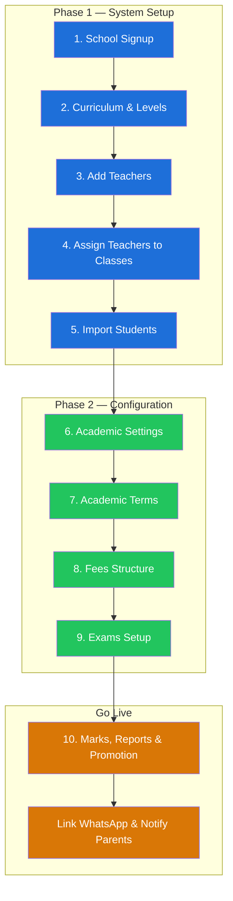
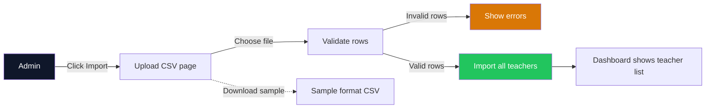
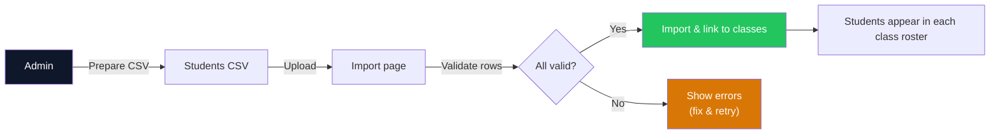

# School Setup Guide

How to set up your school on KlassApp — either manually through the admin panel, or conversationally with the AI Onboarding Agent.

> **Verified against code**: Every route, controller, and form field referenced below exists in the current codebase. Audit date: June 2026.

---

## Pre-Onboarding Checklist

Share this with the school before starting so the setup goes smoothly.

### Essential (must have ready)

| Item | Details needed |
|---|---|
| **School name** | Full official name |
| **School type** | Primary / Secondary / Primary & Secondary (Mixed) |
| **Levels** (if Secondary) | O-Level only, A-Level only, or Both |
| **Gender** | Boys, Girls, or Mixed (Co-ed) |
| **School email** | Active email address |
| **School phone** | Ugandan number (+256 format) |
| **Admin name** | Full name of the person managing the system |
| **Admin email** | Their email address |
| **Admin phone** | Their WhatsApp number (+256) |
| **Academic year** | e.g. 2025 or 2025/2026 |
| **Teacher names** | List of all teachers (can upload via spreadsheet) |
| **Class list** | Names of all classes — can upload via spreadsheet (e.g. Primary 1–7, Senior 1–6) |

### Nice to have (prepared in advance)

| Item | Why it helps |
|---|---|
| **Student names** | Bulk upload via spreadsheet or document (CSV, XLSX, PDF, DOCX) |
| **Subject per class** | Custom subjects beyond NCDC defaults |
| **Term dates** | Custom start/end dates per term |
| **Fee categories** | Names and amounts (e.g. Tuition $50, Lunch $20) |
| **Exam names** | e.g. End of Term, Mid Term, Mock |

---

## Paths

| Path | Best for | Time |
|---|---|---|
| **Manual** | Detailed control, one-at-a-time setup | ~30 min |
| **AI Agent** | Fast batch setup via natural language | ~5 min |

Both paths produce the exact same result. You can mix them — use the agent for bulk setup (teachers, classes) and manual forms for fine-tuning (grading rules, fees).

---

## Manual Path (Step by Step)



---


## Phase 1 — System Setup

### 1. School Signup

**Manual:** The school admin creates the account at the registration page, providing:

- School name
- Admin name (Head Teacher, Secretary, or assigned person)
- Country
- Mobile number
- Approximate number of students
- Email address
- Password

Once submitted, the system creates the school profile.

**Agent:** "Set up Kabale Junior School — primary, P.1-P.7, 12 teachers." The agent extracts school name, type, class range, and teacher count from a single sentence.

---

### 2. Curriculum & Levels

**Manual:** After signup, select the education structure:

- **Board of Education** — typically UNEB
- **Highest level offered** — nursery, primary, O-level, A-level, or a combination

When you select a level, the system automatically creates default subjects for each class and a default grading system.

> Selecting **Primary** automatically creates the nursery section alongside it — primary schools do not need to set up nursery separately.

**Agent:** The agent confirms the curriculum defaults and allows customization: "Add Top Class and Baby Class. Also add Agriculture as a subject."

---

### 3. Add Teachers

**Manual:** Navigate to **Users > Staff > Teachers**. Three options:

- **Add** — single teacher form (best for 1-2 teachers)
- **Import** — bulk CSV via `POST /admin/importTeachers`. Columns: `employee_id, designation, firstname, lastname, gender, date_of_birth, address, city, state, country, pincode, mobile_no, email, notes, status`
- **Export** — download current list



Click **Download Sample Format** to get a template with the correct columns.

**Agent:** "Paste your teacher list or upload a CSV." The agent parses names and auto-generates email addresses.

---

### 4. Assign Teachers to Classes & Subjects

**Manual:** Navigate to **Classes** (`/admin/standardLink/add`). Use the **Setup A Class** button. For each class, select:

- **Level** (e.g. Primary)
- **Class** (e.g. P.6)
- **Class Teacher**

A form appears linking subjects to teachers. Pick the teacher for each subject from a dropdown. Click **Save Class Details**. Repeat for every class.

**Agent:** "Nakamya teaches Math to P.5 through P.7. Tumwesigye teaches English to all classes." The agent maps natural language to the correct StandardLink + Subject records.

---

### 5. Import Students

**Manual:** Same process as teachers. Navigate to the student section and use **Import** with columns:

```csv
firstname,lastname,gender,date_of_birth,class,address,region,district,country,mother_tongue,joining_date
```



The system matches the **class** column to classes set up in Step 4. Each student is enrolled in the correct class.

**Agent:** Same as teacher import — paste list or upload CSV.

---

## Phase 2 — Configuration

### 6. Academic Settings

**Academic Years:** The system shows two years — current and next. Verify the correct year is marked as **Current Academic Year**. Edit via the pen icon under Actions.

**School Details:** Edit profile — address, motto, contact info. Appears on report cards and official communications.

**Grading System:** Created automatically in Phase 1 Step 2. Modify ranges or add new rules via **Add Grading Rule**.

**Promotion Rules:** Click **+ Add Promotion Rule** and configure class, rule type (Points, Aggregates, or Average), and threshold.

---

### 7. Academic Terms

Add terms via **Add Term** (`/admin/terms`):

| Field | Example |
|---|---|
| Name | Term 1, Term 2, Term 3 |
| Starts on | Term start date |
| Ends on | Term end date |

| Term | Typical Dates |
|---|---|
| Term I | February – April |
| Term II | May – August |
| Term III | September – December |

At academic year end, update dates via the edit button — no need to delete and recreate.

---

### 8. Fees Structure

Navigate to Fees (`/admin/fees`). Click **+ Add Category** and fill in:

- **Level** — e.g. Primary
- **Class** — specific class or Select All
- **Academic Term** — specific term or Select All
- **Fee Name** — Academics, Transport, Lunch, etc.
- **Amount** — line-item fee (not total school fees)

Add each fee category separately. The system sums them per student.

---

### 9. Exams Setup

Navigate to Exams. Click **Add Exam**. Select class, fill in exam details, assign teachers. Add multiple exams per term (e.g. Mid-Term, End-of-Term, End-of-Year).

---

## Phase 3 — Go Live

### 10. Marks, Reports & Promotion

Once exams are set up and marks entered:

- Filter by Term, Class, and Exam Type to view marks
- Download marks sheet via **Download Marks Sheet**
- View printable reports per student
- Promote students at year-end using promotion rules from Step 6

If it is the end-of-year exam, download marks sheets and reports before promoting. Once promoted, previous year's class data is archived.

### 11. Link WhatsApp & Activate

1. **Link WhatsApp** — connect the school's WhatsApp number through the admin panel
2. **Import parents** — upload CSV linking students to parent phone numbers
3. **Configure roles** — assign which staff trigger which notifications
4. **Dry test** — send a test message to verify delivery
5. **Go live** — the first real notification goes out

---

## After Setup

Continue to the admin dashboard to:

- Set promotion rules (Academics → Promotion Rules)
- Configure grading system adjustments (Settings → Grading System)
- Customize school details (Settings → School Details)

---

---

## AI Agent Path

Toshi is a Livewire component (`@livewire('agent-toshi')`) embedded in both the superadmin and school admin dashboards. It follows an AWS-style interactive Q&A pattern: one question at a time, recommended defaults, confirm before committing. Toshi uses the same curriculum defaults as the manual seeder (NCDC Uganda), auto-detects school type from natural language, and writes all records in a single database transaction.

**1. Open the agent** — it appears at the top of the superadmin or school admin dashboard.

**2. Answer questions** — the agent asks sequentially:

```
KlassApp Onboarding Agent: "What's the name of your school?"
You: "Kabale Junior School — primary, P.1-P.7, 12 teachers"

Agent detects: school type=primary, classes=P.1-P.7, teacher count=12
Agent asks: "Is primary correct? (yes / no)"
Agent asks: "What email for the school?"
Agent asks: "Admin name?"
Agent confirms: academic year 2026
Agent creates: standards, classes, subjects (NCDC defaults)
Agent asks: "Paste your teacher list"
You: paste 12 names
Agent: "Parsed 12 teachers. Continue?"
Agent asks: "Link teachers to classes? Describe or skip"
You: "Nakamya teaches Math to P.5-P.7"
Agent asks: "Add students now or later?"
Agent confirms: terms (Feb-Aug), fees, exams
Agent: "Review: Kabale Junior School, primary, 7 classes, 12 teachers. Type commit to save."
You: "commit"
Agent: "Done. Login sent to admin@kabalejunior.sch.ug."
```

**3. Done.** The agent commits everything in a single database transaction. If any step fails, nothing is saved.

**What the agent creates:**
- School record
- Academic year (current year)
- Standards and sections (auto-detected from school type)
- Subjects per class (NCDC Uganda curriculum defaults)
- Teacher user accounts (with auto-generated emails)
- Academic terms (Term I-III, Ugandan calendar)
- Optional: teacher-class-subject links, student list, fees, exams

**What the agent does NOT create** (use manual path for these):
- Grading system rules (already auto-created with defaults)
- Promotion rules
- Custom school details (address, motto)

---
